# Customize the TRIRIGA user experience with Carbon Design Components
*by Joshua Meurer, Amy Millett, and Leonardo Mellaci de Matos*

In this *tutorial* you will learn how to customize the skin and user experience in TRIRIGA using resources aligned with Carbon, IBM's open-source design system for products and experiences.   

[IBM TRIRIGA](https://www.ibm.com/products/tririga), is an intelligent real estate and facilities management solution. Through the power of IoT and AI, it provides businesses with insight into capabilities such as space, utilization, capital projects and lease administration and accounting. Developers can innovate and extend [IBM TRIRIGA](https://www.ibm.com/products/tririga) by developing [perceptive apps](https://www.ibm.com/developerworks/community/wikis/home?lang=en#!/wiki/IBM%20TRIRIGA1/page/UX%20Perceptive%20Apps) which are dynamic, custom applications built using the [TRIRIGA UX framework](https://www.ibm.com/developerworks/community/wikis/home?lang=en#!/wiki/IBM%20TRIRIGA1/page/UX%20Framework). Developers can also [customize the user experience](https://www.ibm.com/support/knowledgecenter/SSHEB3_3.6.0/com.ibm.tap.doc/uex/c_ctr_config_uex.html) of TRIRIGA with custom styles.  

[IBM Carbon Design System](https://www.carbondesignsystem.com/) is IBM’s open-source design system for products and experiences. With the IBM Design Language as its foundation, the system consists of working code, design tools and resources, human interface guidelines, and a vibrant community of contributors. Carbon provides a complete set of development resources such as core Carbon user interface components, design resources like themes, colors, icons, etc., developer tools and learning resources.  

## Prerequisites
This tutorial assumes that you are familiar with TRIRIGA. In order to complete this tutorial, you will need access to a running instance of IBM [TRIRIGA](https://www.ibm.com/products/tririga). You will need to have administrator access to this instance of TRIRIGA.  

## Estimated time
Completing this tutorial should take approximately 1-2 hours.  

## Steps
### 1. Get the TIRIRIGA Carbon Style Pak code and styles

Get the code and styles for the Carbon Style Pak by cloning the GitHub repository [IBM TRIRIGA Carbon Style Pak.](https://github.com/ibmtririga/tri-carbon-style-pack)  

### 2. Launch the TRIRIGA Style Manager
TRIRIGA comes installed with a default set of styles. These styles can be customized to your needs or adhere to your organization's style standards. The Style Manager component in TRIRIGA is a tool that allows administrators to customize styles in TRIRGA. In TRIRIGA navigate to **Tools>Style Manager**  

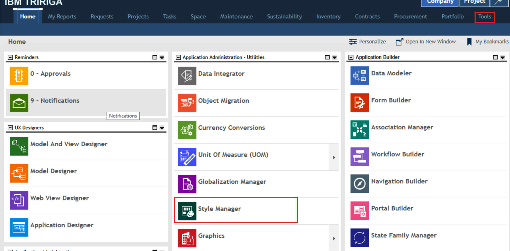  

### 3. Import the custom Carbon Style
In the Style Manager, navigate to the action tool bar and select the ***Import*** link (at the left). This launches a dialog box with an option to select the custom Carbon style that has been provided. The custom Carbon stylesheet is named TRIRIGA_Carbon_Styles_n.n.xml and is available in the root of your main directory.  You can refer to the instructions in the [Customizing Visual Components -> Styles and Colors](https://www.ibm.com/support/knowledgecenter/SSHEB3_3.6.0/com.ibm.tap.doc/uex/t_ctr_colors_and_styles.html) section of the TRIRIGA Knowledge Center for more information of customizing visual components in TRIRIGA.

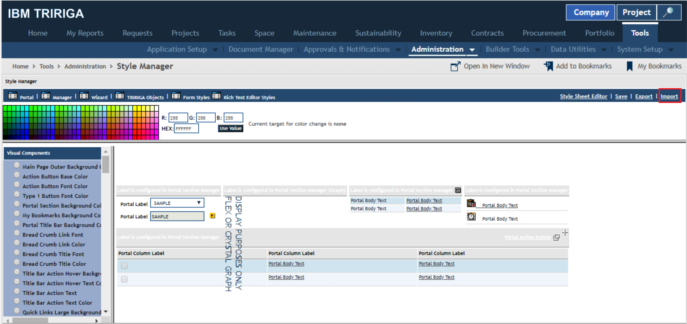  

In the pop-up dialog that appears after clicking the ***Import*** link, select the custom Carbon Style XML document and click the **Import** button.  

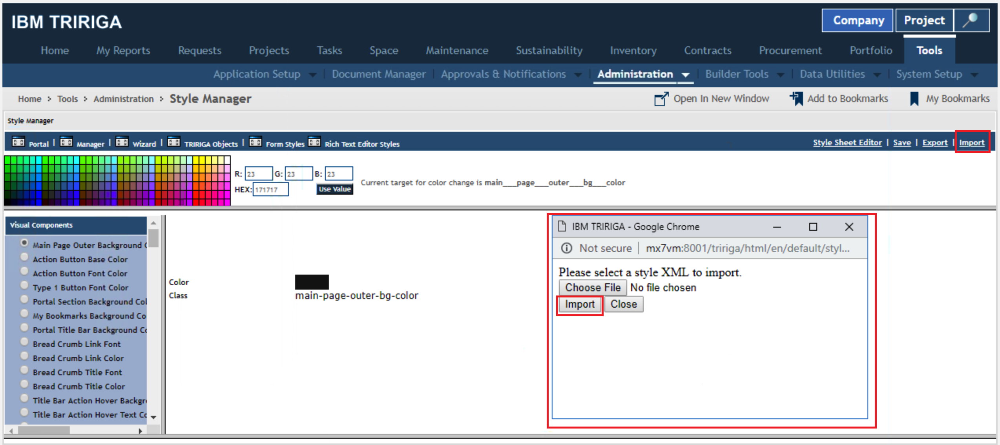  

### 4. Edit custom styles in the Style Editor

In the **Style Manager** open the style sheet editor by clicking the ***Style Sheet Editor*** link next to the ***Import*** link to launch the **Style Sheet Editor**. In the Style Name column at the right in the **Style Sheet Editor**, select the style labelStyleClass1. For the style labelStyleClass1, navigate the **Font Properties** section. Click the ***Edit*** link at the top of the Style Name section to enter edit mode. Change the Font Color property in the **Font Properties** section to 23, 23, 23 as in the image below.

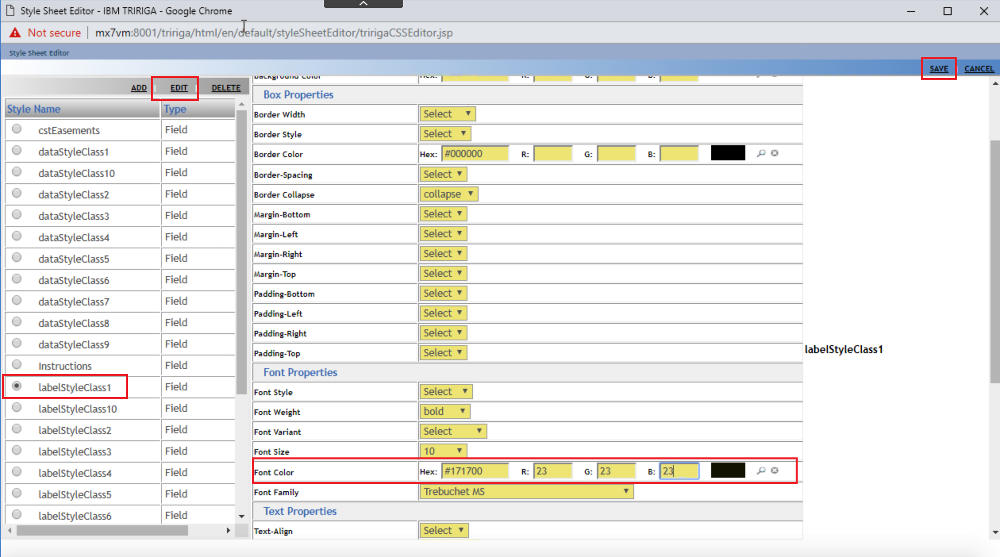  

### 5. Copy custom logo and link background images
Locate the  custom logo and link background image files, logo.gif and linksBacground.gif that are in your cloned GitHub repository in the directory ```<cloned githug repo location>/userfiles/images/```. With TRIRIGA running, copy these to images to your TRIRIGA instance under ```<tririga install directory>/userfiles/images```.

### 6. Clear the TRIRIGA portal logo cache
With the TRIRIGA sever still running, navigate to the admin console (***http://hostname:port/context-path/html/en/default/admin***) **Cache Manager**. Navigate to the ***Caches*** menu link on the right and click on the ***Portal Logo*** link to clear the portal logo cache. The message "Portal Logo Flushed" will appear at the top in the **Flush a Cache** section once the cache has been flushed.

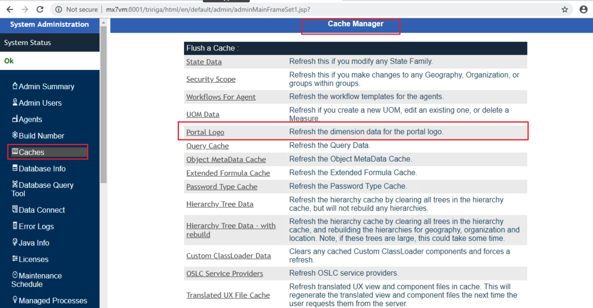  

### 7. Clear your browser cache  
Clear your browser cache before proceeding.

### 8. Copy the Carbon Style Pak images to TRIRIGA
Copy the images from the style pack folder ```/userfiles/images/gen/squared``` of the clone GitHub repository into the directory ```<tririga install directory>/userfiles/images/gen/squared``` on the TRIRIGA server.  

### 9. Copy the Carbon Style Pak icons to TRIRIGA
Copy the images from the style pack folder ```/userfiles/images/icons``` of the clone GitHub repository into the directory ```<tririga install directory>/userfiles/images/icons```  on the TRIRIGA server.  

### 10. Restart TRIRIGA
Restart the instance of the TRIRIGA server for these changes to take effect.

### 11. Log in to TRIRIGA and see the new skin
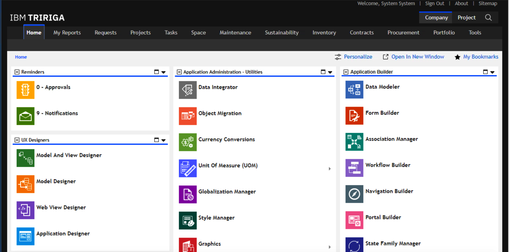    

### 12. Update the portal icons
The **Navigation Build** is used to update portal icons. Launch the **Navigation Builder** application.

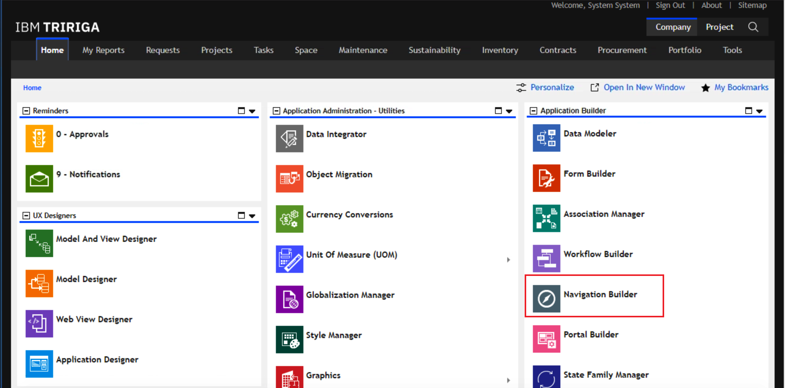   

### 13. Update the styles for Navigation Item Collections
Navigate to the ```<tririga install directory>/Icon Pak``  directory in the clone GitHub Carbon Style Pak repository. Each sub-directory in this directory contains styles for navigation links. The names of the folders in the icon pack directory of the downloaded style pack correspond to the name of the **Quick Links Navigation Item Collection** for the items that the new icons belong to.  

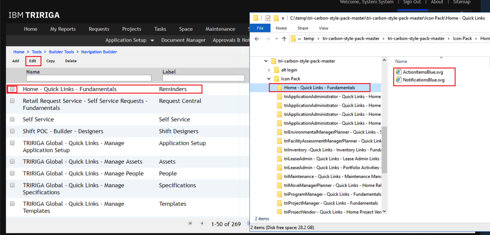  

### 14. Edit Navigation Item Collections
Each **Navigation Item Collection** that corresponds to a folder in the cloned GitHub repository will need to be edited by changing the corresponding icon. To edit each **Navigation Item** and replace the corresponding icons, select the ***Navigation Item*** and click on the **Edit** button. In the ***Edit Navigation Collection - <Navigation Item>*** screen, you will need to replace the icon associated with each **Navigation Item** (left pane) with the SVG file with the corresponding name from the cloned GitHub repository.

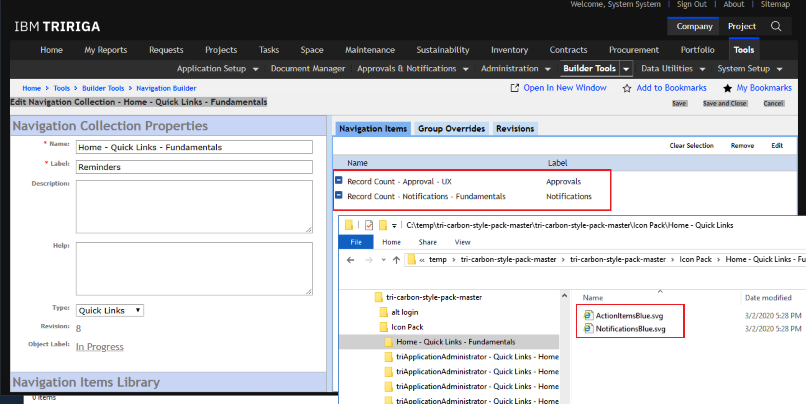    

### 15. Edit each Navigation Item and upload the corresponding icon
Select each Navigation Item in the right pane, by seleting the Navigation Item, and clicking the ***Edit*** link at the top of the pane.  

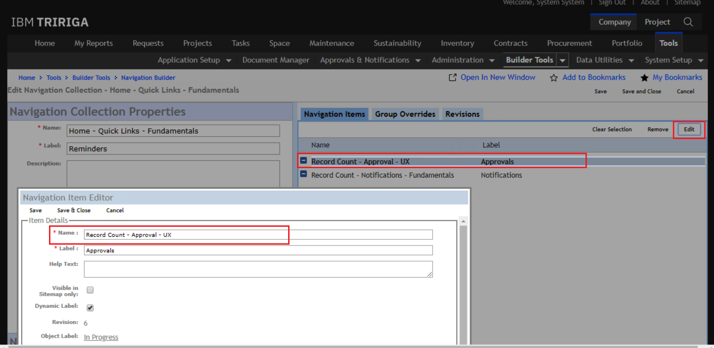  

This launches the **Navigation Item Editor** dialog. Navigate to the **Upload Icon** section in this dialog, click on the ***Choose File*** button and select the corresponding SVG file from the cloned GitHub repository. Once you have replaced your Navigation Item icon, click ***Save and Close*** at the top of this dialog. (For the Navigation Item Collection - Home - Quick Links - Fundamentals, the icon ActionItemsBlue.svg does not correspond to the Approvals Navigation Item.) 

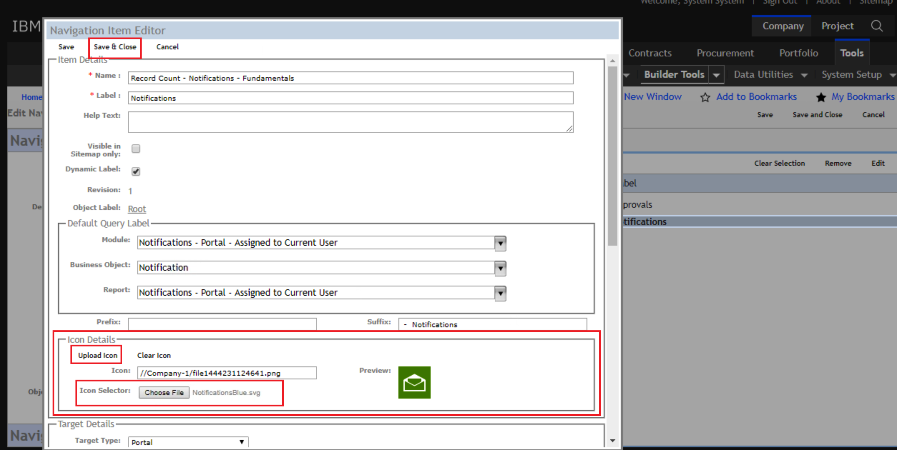  

**Note:** It is recommended to create a new application Label  “TRIRIGA Carbon Icons” and apply that label to all these updated Navigation Items. Or if your organizations has other practices for applying object labels in TRIRIGA feel free to adhere to those practices. You will need to use the **Object Label Manager** utility to create the label and apply it.

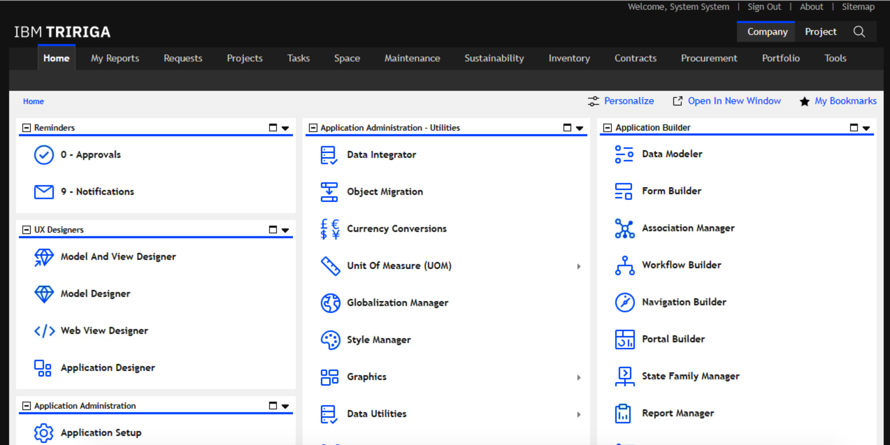  

### 16. Customize and configure the Sign In Page

**Note:** For environments that been upgraded to the 3.7 or later version of the TRIRIGA platform. Customizing the login page is no longer needed. The Carbon Style version of the login is included in the platform upgrade.

Developers with TRIRIGA administrative privileges can customize the sign in page. The content (ex. instructions) and look and feel of the default and alternate TRIRIGA sign in page can be customized. The only image that can be change in the default sign in page is login_background.png. You can create an alternate sign in page using the index.html page typically found in ```<TRIRIGA home>/userfiles/alt/```.  

To help you create a custom login page in this tutorial, resources have been provided in the accompanying GitHub repository. These resources for the UX alt login are in the Style Pack directory named ```Perceptive Apps Alt Login`` of your cloned GitHub repository. The view resources are in the folder ```tricarbon-login```.   

To create a custom login page:

* Create a new view using the **Web View Designer**
* Deploy the code and content for the new login page using the ```tri-deploy``` npm utility
* Update the ```TRIRIGAWEB.properties``` file with the location of your custom login page resources
* Copy your custom login page resources to this location

#### Create a new view using the **Web View Designer**
Create a new web view for your custom login page before running the ```tri-deploy``` npm tool that is used to deploy your custom UX login view to the TRIRIGA Server. To create the new web view, launch the  **Web View Designer** application.

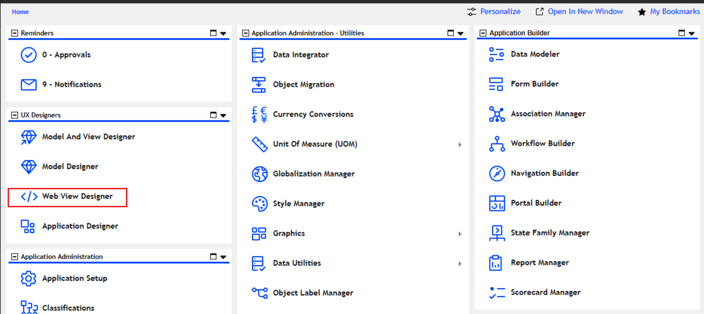  

And click the ***Add*** link at the top of the **Web View Designer** to create a new view. create a new view called *tricarbon-login* i.e. the name should match the name of the directory (or view) that will be specified in the ```tri-deploy``` command.  

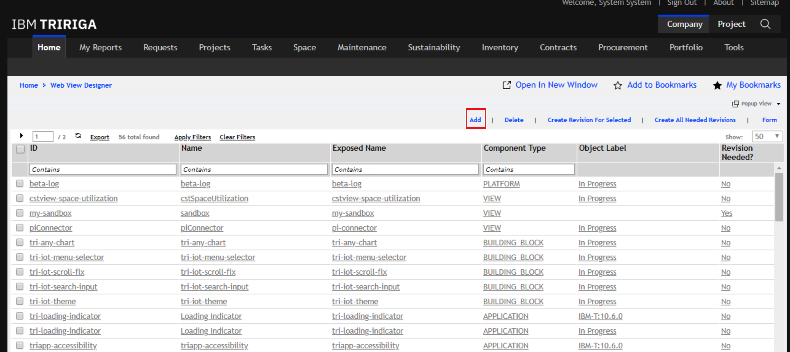  

Enter the Name, ID and Component Type details and Click **Save & Close**  

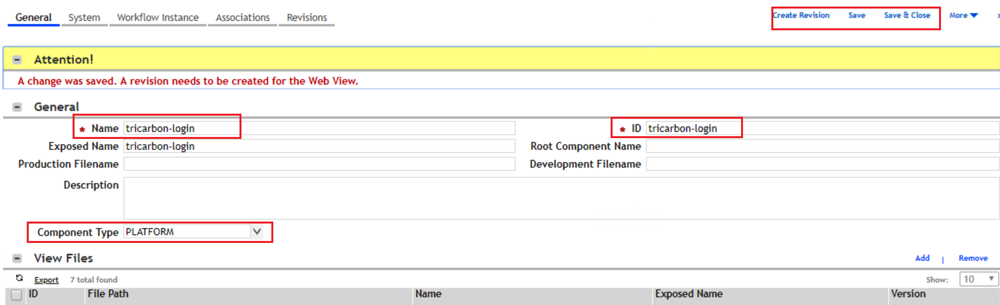  

#### Deploy the code and content for the new login page using the tri-deploy nmp utility
To deploy the new login UI view and assets, you will need to have [Node.js and npm])(https://nodejs.org/en/download/) installed. You will also need a npm [tri-deploy](https://www.npmjs.com/package/@tririga/tri-deploy) package which is a tool for deploying TRIRIGA UX views to an instance of TRIRIGA.

To deploy these resources, navigate to the  `/alt login` sub-directory of the code cloned from GitHub and run
```
$ cd alt login/
$ tri-deploy -t <tririga_url> -u <user> -p <password>
```

*Note:* You should run this command from the directory that contains the alt login resources from the cloned GitHub repository i.e. ```<root>/alt login/Perceptive Apps Alt Login/tricarbon-login```. The parent directory name must match the name of the web view you created in the previous step. If you get an error when running the command related to spaces in the path, copy the resources to a path that does not contain spaces and run the command from this new directory location.

**Note:** For environments that been upgraded to the 3.7 or later version of the TRIRIGA platform. Customizing the login page is no longer needed. The Carbon Style version of the login is included in the platform upgrade.

#### Update the TRIRIGAWEB.properties with the location of your custom login page resources  
To update the ```TRIRIGAWEB.properties``` file with the location of your custom login page resources, you will need to use the **Administrator Console** ***http://hostname:port/context path/html/en/default/admin***. Navigate to the ***System Info*** tab on the right of the **Administrator Console**. In the **Property Files** pane to the right, click on the ***Edit*** link besides the TRIRIGA Web property file. See these [Knowledge Center ](https://www.ibm.com/support/knowledgecenter/SSHEB3_3.6.1/com.ibm.tap.doc/uex/t_configure_sign_in_page.html) instructions for details.

 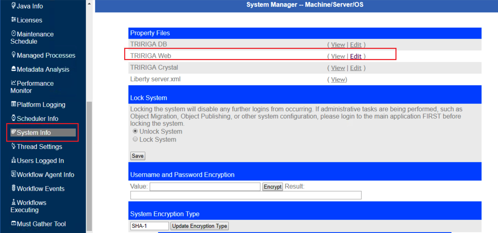

Using the Web Properties view, you will be editing the ```TRIRIGAWEB.properties``` with the location of your custom login page as well as referenced image resources. You will need to verify or modify the following properties in the image below and save you changes once you are done.

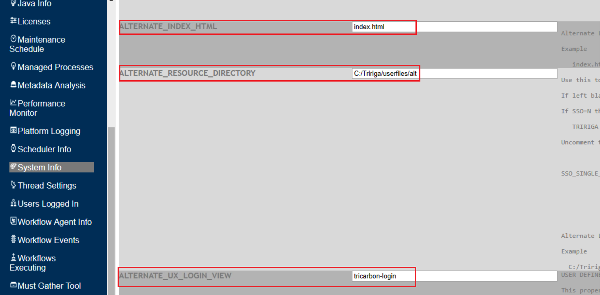

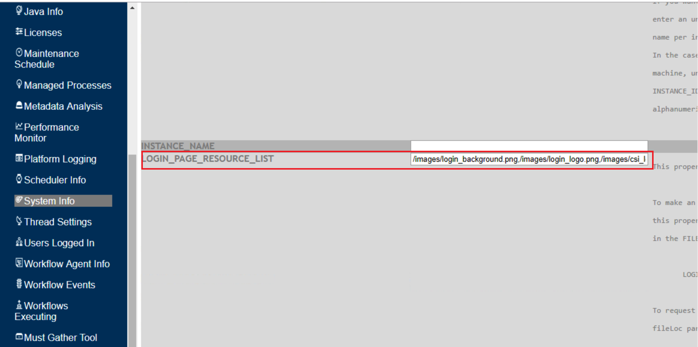  

#### Copy your custom login page resources to this location 
Once you have updated and saved your properties, you can verify the changes by examinig the ```TRIRIGAWEB.properties``` file which can be found in the directory ```<TRIRIGA home>/config```.

```
...
ALTERNATE_RESOURCE_DIRECTORY=C\:/Tririga/userfiles/alt
...
ALTERNATE_INDEX_HTML=index.html
...
LOGIN_PAGE_RESOURCE_LIST=/images/login_background.png,/images/login_logo.png,/images/csi_logo.png,/images/icons/favicon.ico,/images/BuildingsLowResBlur.svg,/images/Buildings.jpg
...
ALTERNATE_UX_LOGIN_VIEW=tricarbon-login
...
```
 Finally copy the resources from the ***Foundation Alt Login*** directory in the Style Pack to the corresponding locations based on the settings shown above. You might need to restart TRIRIGA for the changes to take effect. Launching TRIRIGA once it has been restarted takes you to your new TRIRIGA login page.

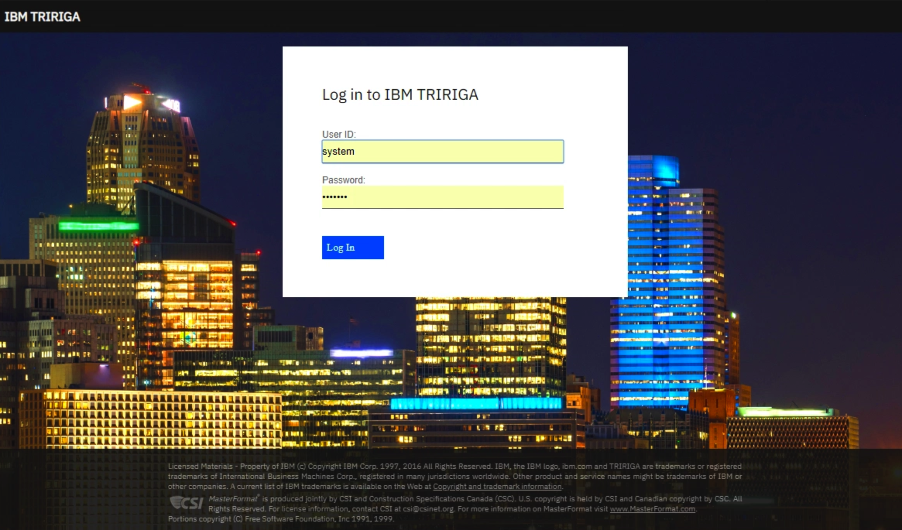


## Summary
After completing this tutorial, you should have good understanding of how to customize the user interface of TRIRIGA using styles and icons from the Carbon Design system as well as with your own custom styles.


